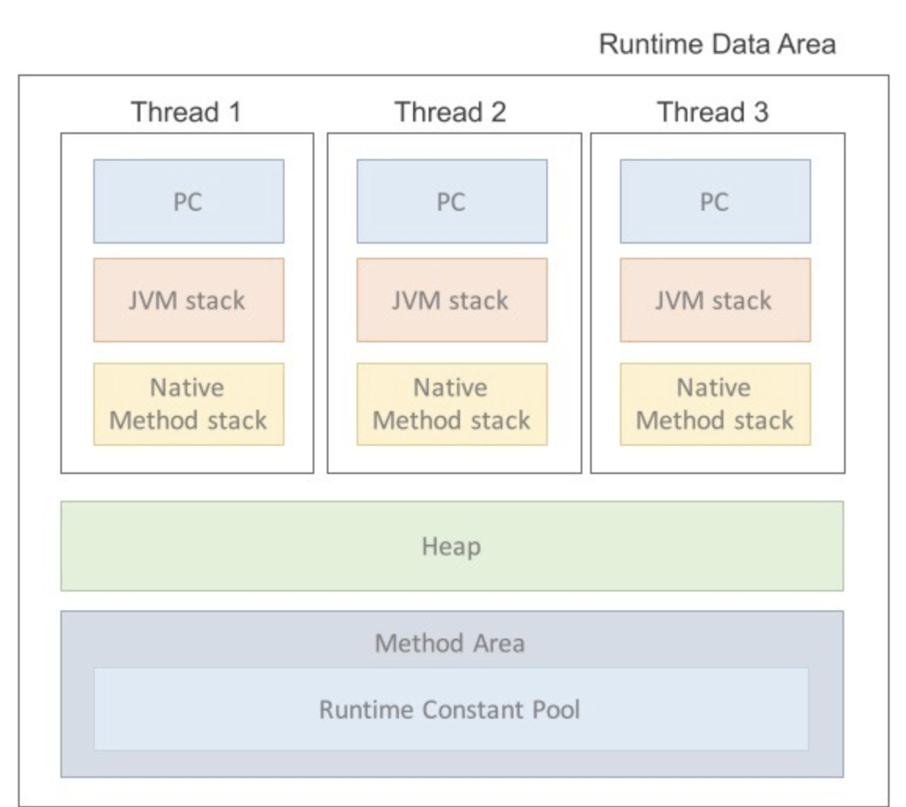

### 참조 타입이란

객체의 번지를 참조하는 타입으로, 배열, 열거(enum), 클래스, 인터페이스를 말한다.

### [String Pool]

자바는 반복되는 문자열 리터럴을 저장해두고 같은 영역을 참조해서 사용한다.

- 메모리를 아낄 수 있다
- 힙 메모리 영역에 저장된다
- 참조하는 대상이 없다면, GC의 대상이 된다.

예를 들어,

```java
String name1 = "김지호";
String name2 = "김지호";

name1 == name2 // True
```

그런데, 만약 name1의 값이 수정되면 어떻게 될까? → 과연 name2도 같이 수정될까?

No.

**문자열은 불변 값이다.** 즉, 기존의 메모리 값을 바꾸는게 아닌 바뀐 값의 새로운 메모리가 할당되고 해당 메모리가 `name1`에 저장된다.

```java
name1 = "김윤호";
name1 == name2 // False
```

반면, `new String` 생성자를 통해 객체로 생성하는 모든 문자열은 서로 다른 주소를 가지게 된다.

### 그렇다면 어떻게 문자열을 선언해서 사용하면 될까?

당연히, 문자 리터럴로 정의하여 `String Pool`기능을 이용하자. 또한, 메모리 값을 저장하는 원시 타입이므로 예기치 않은 오류에 대처하기 위해 문자열간의 비교는 `str1.equals(str2)`를 사용하자.

---

[JVM 메모리 사용 영역]

JVM의 메모리 사용 영역(Runtime Data Area)는 3가지 영역으로 구성된다.



**모든 스레드가 공유하는 자원**

> 스레드 : 프로세스 내에서 작업을 수행하는 주체

1. 스택 (Stack)

   스택 프레임 (지역변수, 매개변수 등)이 저장되는 장소

2. PC Register

   현재 실행중인 JVM 주소 (CPU(기계어) 명령어)

   > 자바는 OS나 CPU의 입장에서는 하나의 프로세스이기 때문에 가상 머신, JVM의 리소스를 이용해야 gksek.
   > 이때, PC 값은 실제 운영체제의 PC값이 아닌, JVM의 실행 주소이다.
   > PC Register에 직접적으로 연산을 저장하는 방식이 아닌 연산의 주소 값을 저장하는 방식

3. Native Method Stack Area

   자바 외 언어를 위한 공간?

**스레드마다 할당되는 자원**

1. 힙 (Heap)

   런타임에 동적으로 할당하여 사용되는 데이터 (new 연산자로 선언된 객체, 인터페이스, 배열 등)를 저장하는 장소

   → GC의 대상이 되는 공간

2. 메소드 영역 (Method Area) i.e. Class Area, Static Area

   JVM이 시작될 때 생성되는 공간으로 바이트 코드(.class)를 처음 메모리 공간에 올릴 때 초기화되는 대상을 지정하기 위한 메모리 공간이다.

   → 프로그램이 종료될 때까지 저장된다.

   정적 필드와 클래스 구조만을 지니고 있다.

   - Runtime Constant Pool (Table)영역도 존재하는데, 이는 클래스 생성할 때 참조해야할 정보들을 상수로 지니고 있다.

   - JVM은 이를 통해 상수 자료형을 참조하고 중복을 막는 역할을 한다.

### 배열

생성 방법

```java
// #1. 선언과 동시에 초기화
타입[] 변수명 = {값1, 값2, ...};
// #2. new 키워드를 통해 생성 + 초기화
타입[] 변수명 = new 타입[] {값1, 값2, ...};
// #3. 2차원 배열 생성 + 초기화
타입[][] 변수명 = new 타입[][] {값1, 값2, ...};
// #4. 2차원 배열의 크기를 전부 명시하지 않음
타입[][] 변수명 = new 타입[값][];
```

주의

- 2차원 배열을 선언시, `row` 개수만 정해주는 것은 괜찮으나, `col` 개수만 정해주는 것은 불가능하다.
  - 이유: 메모리 주소 할당을 위해

만약, 배열을 생성하고 초기화하지 않는다면 다음과 같은 값으로 채워진다.

| 정수 타입 | 0     |
| --------- | ----- |
| 실수 타입 | 0.0   |
| 논리 타입 | false |
| 참조 타입 | null  |

- 배열 길이 : `arr.length;` 로 접근한다.
- 배열 출력

  - `Arrays.toString(배열명)`
  - `import java.util.Arrays` 의 toString() 메소드를 사용하면, 배열을 문자열 배열로 바꾸어 출력해준다.

    - 배열을 반환하는 것이 아닌, 문자열 한개를 반환한다는 점을 주의!

    ```java
    import java.util.Arrays;

    public class Main {
        public static void main(String[] args) {
            int[] arr = new int[10];
            for (int i = 0; i < arr.length; i++) {
                arr[i] = i;
            }
            String strArr = Arrays.toString(arr);
            System.out.println(strArr); // [0, 1, 2, 3, 4, 5, 6, 7, 8, 9]

        }
    }
    ```

- 배열 복사

  1. for 문을 사용한 복사
  2. `Object.clone()`

     모든 클래스의 부모 클래스는 Object이다.

     해당 Object 클래스에는 clone() 메소드가 존재하며, 객체를 생성한 이후 복제할 때 사용하는 기능이다.

     ```java
     int[] scores = { 1, 2, 3, 4, 5 };
     int[] newScores = scores.clone();
     ```

  3. `Arrays.copyOf(배열, 복사길이)`

     특정 배열의 복사길이만큼 복사하는 `Arrays` 클래스의 메소드.

     - 실제로는 System.arraycopy() 메소드를 사용하는 또 다른 메소드이다.
       [실제 copyOf 코드]
       ```java
       public static int[] copyOf(int[] original, int newLength) {
               int[] copy = new int[newLength];
               System.arraycopy(original, 0, copy, 0,
                                Math.min(original.length, newLength));
               return copy;
           }
       ```

     ```java
     int[] scores = { 1, 2, 3, 4, 5 };
     int[] newScores = Arrays.copyOf(scores,scores.length);
     ```

  4. `System.arraycopy()` 메소드를 사용한 복사

     > `System.arraycopy(원본, 원본 시작인덱스, 복사본, 복사본 시작인덱스, 복사할 개수);`

     ```java
     import java.util.Arrays;

     public class Main {
         public static void main(String[] args) {
             int[] arr = new int[10];
             for (int i = 0; i < arr.length; i++) {
                 arr[i] = i;
             }

             int len = arr.length;
             int[] newArr = new int[len + 2];
             System.arraycopy(arr,0,newArr,0,len);

     				// [0, 1, 2, 3, 4, 5, 6, 7, 8, 9, 0, 0]
     				// 복사하지 않은 값은 기존 기본값으로 채워진다.
             System.out.println(Arrays.toString(newArr));
         }
     }

     ```

     **깊은 복사**

  - 자바는 깊은 복사를 지원하는 라이브러리는 없어서 직접 수행해야 한다.

  ```java
  // deepcopy 메소드 생성
  int a[][] = {{1,2,3},{4,5,6,},{7,8,9}};
  int b[][] = new int[a.length][a[0].length];

  for(int i=0; i<b.length; i++){
      System.arraycopy(a[i], 0, b[i], 0, a[0].length);
  }
  ```

### 열거 (enum) 타입

열거 타입을 선언하면, 선언된 열거는 힙에 저장된다.

- 선언된 enum을 토대로, 힙에 `Week`가 저장된다.
- 이후, 값을 참조하면 해당 참조값을 가리킨다.

```java
public enum Week {
	MONDAY,
	TUESDAY,
	WEDNESDAY,
	THURSDAY,
	FRIDAY,
	SATURDAY,
	SUNDAY
}

Week today = Week.MONDAY // today는 스택에 저장된다.
//출력
today == Week.MONDAY // 메모리 값을 출력함에도 불구하고 같은 값을 지님.
```
