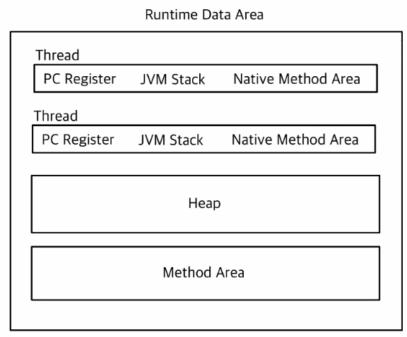

### JDK (제일 상위)

자바 개발을 위해 필요한 모든 것을 가지고 있는 소프트웨어 환경

자바 애플리케이션을 개발하고 실행하기 위해 필요한 모든 도구를 지니고 있다.

- `javac` 명령어로 컴파일 가능
  > JDK 버전은 논의를 거쳐 진행한다. 보통 JDK 버전 업을 마지못해 한다.

Q&A

- 어떤 도구가 포함될까?
  컴파일러, 디버깅 도구, JVM, JRE
- `javac` 명령어로 실제 컴파일 해보기.
  `javac -d 컴파일된-파일-저장-폴더 대상-파일`
- C/C++은 원래 컴파일하면 기계어 코드로 변환되는데 다른 과정인가?
  C/C++ 코드는 기계어 코드로 컴파일 하는 대신, 자바 코드는 클래스 파일로 컴파일이 진행된다.
  이후, JRE 환경에서 인터프리터와 JIE로 실행된다.
  → 플랫폼 독립적인 환경을 위한 설계

### JRE (Java Runtime Environment)

자바 실행을 위한 환경. JRE만 독립적으로도 설치할 수 있다.

> 배포환경에서는 JRE만 설치하여 사용 가능. JVM, 프로그램 핵심 라이브러리(java.util, java.lang 등)
> Java 11 버전부터는 불가능하다.

---

---

## TL;DR

## JVM 작동방식

1. JVM이 OS로부터 메모리를 할당받고, JVM은 할당받은 메모리를 여러영역으로 나눠서 관리한다.
2. 컴파일러 소스코드 읽어들여서 바이트코드로 변환한다. (`javac`)
3. 클래스로더를 통해 바이코드 파일들을 JVM으로 로딩한다.
4. 로딩된 클래스파일들이 실행 엔진으로 실행된다.
5. 해석된 바이트코드 메모리에 배치가 되어있고 수행이 이루어진다. → GC가 함께 이루어진다.

---

---

## 자바의 컴파일과 런타임


### 1. 컴파일 타임

JDK에 포함된 컴파일러를 통해 자바 소스 코드(`.java`)를 바이트 코드(`.class`)로 변환하는 과정을 수행한다.

→ 컴파일 과정에서 오류가 발생하면 에러를 띄운다

- 클래스 파일의 메타 데이터를 생성.
  - 이름, 생성자/필드/메서드에 대한 정보를 포함
  - 클래스 파일의 constant pool 영역에 저장
  - 접근 제어자, 클래스 인덱스(클래스 자체에 대한 인덱스), 부모 클래스 인덱스, 인터페이스 인덱스, 필드 정보, 메서드 정보 등 포함.
  - **매핑 정보도 여기에 저장된다**
    변수가 어떤 스택 프레임에 매핑되는지에 대한 정보는 **JVM의 바이트코드와 메모리 구조**에 의해 결정되며, 다음과 같은 위치에서 관리됩니다:
    1. **클래스 파일의 메타데이터 (Bytecode Information)**:
       - 자바 컴파일러는 소스 코드를 컴파일할 때 **로컬 변수 테이블(Local Variable Table)**을 생성합니다.
       - 이 테이블에는 각 변수의 이름, 자료형, 스택에서의 인덱스, 유효 범위(scope) 등의 정보가 포함됩니다.
       - 이 정보는 `.class` 파일의 메타데이터에 저장됩니다.
    2. **JVM 런타임 중 로컬 변수 테이블**:
       - 메서드 실행 중, 해당 메서드의 스택 프레임 내부에 로컬 변수 테이블이 동적으로 생성됩니다.
       - 각 변수는 바이트코드에서 정의된 인덱스(슬롯 번호)에 따라 테이블에 매핑됩니다.

### 2. 런타임 타임

컴파일 과정을 통해 생성된 바이트 코드(`.class`)를 실행하는 과정을 수행한다.

### JVM (Java Virtual Machine)

운영체제 위에 JVM을 띄우고, 메모리 영역 차지한 후, 우리가 실행하는 프로젝트가 JVM 위치한다.

3가지 아키텍쳐로 구성되어 있다.

- Class Loader : 바이트 코드를 가져오고
- Runtime Data Area : 메모리에 올리고
- Execution Engine : 실행한다.

**[클래스 로더]**

실행을 하기 위한 바이트 코드를 JVM으로 가져오는 역할

`javac` 를 통해 컴파일된 바이트 코드를 “동적으로” `Runtime Data Area`로 적재한다.

<실제 과정>

1. 로딩 : `.class` 파일을 찾아 메모리에 로드

   - 동적 로딩 `(Dynamic Loading)`으로, 메모리 효율성을 위해 필요한 바이트 코드만 실시간으로 `Runtime Data Area` 에 적재한다.

     - 실제 콘솔창에 로딩되는 파일을 찍어서 테스트 해볼 수 있다.

       1. `javac` 명령어를 통해 [Main.java](http://Main.java) 파일을 컴파일한다.
       2. `java -verbose:class Main` 명령어를 통해 로드된 파일들을 볼 수 있음
          [타깃 클래스]

       ```java
       package classLoader;

       class Outer {
           // static 변수
           static String value = "> Outer 클래스의 static 필드 입니다.";

           // static final 상수
           static final String VALUE = "> Outer 클래스의 static final 필드 입니다.";

           Outer() { System.out.println("> Outer 생성자 초기화"); }

           // static 메서드
           static void getInstance() {
               System.out.println("> Outer 클래스의 static 메서드 호출");
           }

           // inner 클래스
           class Inner {
               Inner() { System.out.println("> Inner 생성자 초기화"); }
           }

           // static inner 클래스
           static class Holder {
               static String value = "> Holder 클래스의 static 필드 입니다.";
               static final String VALUE = "> Holder 클래스의 static final 필드 입니다.";

               Holder() { System.out.println("> Holder 생성자 초기화"); }
           }
       }
       ```

       - 아무것도 없음 → Main 클래스만 로딩
         ```java
         public class Main {
             public static void main(String[] args) {
             }
         }
         ```
         
       - Outer 인스턴스 생성 → Outer 클래스만 로딩 + Inner 클래스의 인스턴스를 생성하지 않았으므로, 로딩되지 않음
       - Outer의 static 변수/메소드 호출 → Outer 클래스를 인스턴스화 하지 않아도, 클래스가 로딩됨
         ```java
         public class Main {
             public static void main(String[] args) {
                 System.out.println(Outer.value); // 인스턴스 생성 없이, 정적 변수 호출
             }
         }
         ```
       - `static final` 변수(상수) 호출 → static final 상수를 호출할 경우 static 변수와 다르게 Outer 클래스가 로드되지 않는다.
         static final은 메소드 영역의 Constant Pool 영역에 따로 저장된다.
         Constant Pool 영역은 런타임 데이터 영역의 Method Area에 저장되는 값으로, GC의 대상이 되지 않는다.
       - 내부 클래스 호출
         내부 클래스를 호출하려면, 외부 클래스를 호출해야 한다.
         또한, 외부 클래스는 필요 없고 내부 클래스만 필요해진 경우에 외부 클래스의 메모리를 계속 적재하고 있어 메모리 누수가 발생한다.
         → 이는 `OutofMemoryError`를 발생시킬 수 있는 심각한 문제이다.

         [해결방법]

         내부 클래스를 `static class`로 선언한다.

         - `static class`로 호출하면, 외부 클래스 인스턴스화 없이 선언가능하기 때문에 참조가 없다.
           `static class`로 선언한 클래스는 외부 클래스와의 참조 고리가 끊긴다.

         [참고 블로그](https://inpa.tistory.com/entry/JAVA-%E2%98%95-%ED%81%B4%EB%9E%98%EC%8A%A4%EB%8A%94-%EC%96%B8%EC%A0%9C-%EB%A9%94%EB%AA%A8%EB%A6%AC%EC%97%90-%EB%A1%9C%EB%94%A9-%EC%B4%88%EA%B8%B0%ED%99%94-%EB%90%98%EB%8A%94%EA%B0%80-%E2%9D%93_)

         [참고 블로그2](https://inpa.tistory.com/entry/JAVA-%E2%98%95-%EC%9E%90%EB%B0%94%EC%9D%98-%EB%82%B4%EB%B6%80-%ED%81%B4%EB%9E%98%EC%8A%A4%EB%8A%94-static-%EC%9C%BC%EB%A1%9C-%EC%84%A0%EC%96%B8%ED%95%98%EC%9E%90)

2. 링크 : 로딩된 `.class` 파일이 JVM에서 실행할 수 있도록 검증, 준비, 해석 과정을 거침
   - 검증 : 명세에 따라 제대로 되어 있는지 검사
   - 준비 : 변수와 기본값을 위한 메모리
   - 해석(분석) : 실제 메모리 주소로 변환
3. 초기화 : 클래스 및 정적 코드 블록을 실행

   클래스 변수들을 적절한 값으로 초기화한다.

[런타임 데이터 영역]



- PC Register
  - 각 스레드가 어던 부분을 CPU가 실행해야 할지 관리하고 기록함
    - 실제 컴퓨터 시스템의 PC값과 같은 값인가? (N)
      자바의 PC 값은 스레드가 JVM의 어느 부분을 실행해야 할지 지니고 있는 것으로, CPU의 Register Base PC가 아닌, Stack Base PC 값이다.
- 스택
  - 스레마다 고유하게 존재하는 영역. 메서드, 지역 변수, 임시 데이터를 관리한다.
  - 스택 프레임 생성 / 제거
- Native Method Area
  - JVM이 아닌, 네이티브 코드를 실행하는 영역이다. 자바가 아닌 다른 언어로 된 메소드를 실행한다.
- Heap
  - 모든 객체와 배열이 저장됨
  - 사용되지 않은 객체는 GC(가비지 컬렉터)에 의해 제거되어 메모리 공간을 확보한다.
    - 힙 영역의 크기는 고정되지 않고 확장되기도 한다??
      - `Xms`: 힙 메모리의 초기 크기를 설정합니다.
      - `Xmx`: 힙 메모리의 최대 크기를 설정합니다.
      ```java
      // 힙 메모리의 초기 크기를 512MB, 최대 크기를 1024MB로 설정하려면 다음과 같이 명령어를 입력합니다:
      java -Xms512m -Xmx1024m YourApplication
      ```
- Method Area
  - 모든 스레드가 공유하는 영역
  - 클래스 정보나 인터페이스 정보 모든 바이트 코드가 로드된다.

[실행 엔진]

컴파일러가 바이트 코드를 한줄 씩 읽어서 OS에 맞게 변환 기계어로 변환해서 실행하는 역할을 한다.

또한, 여러가지 기능들이 있다.

1. 인터프리터(Interpreter)

- 바이트코드를 한 줄씩 읽어서 기계어로 변환하고 실행한다
- 인터프리터는 간단하고 구현하기 쉬우나, 같은 코드를 반복해서 실행될때마다 다시 변환해서 실행 속도가 느림
  - 이를 보완하기 위해 JIT 컴파일러의 도입으로 최적화됨

1. JIT(Just-In-Time) 컴파일러

- 반복 실행되는 부분을 감지하여, 그 부분만 기계어로 미리 컴파일하는 것
- 컴파일 언어 vs 인터프리터 언어 차이점
  컴파일 언어 : 고급 → Low level language, C/C++/Java
  코드가 변경되지 않는 한 1번만 수행하면 됨
  인터프리터 언어 : 한번에 한줄씩 실행하는 코드
  매번 수정될때마다 빌드하는 과정을 거치지 않아도 됨
  > 빌드 : 기계어로 변환하는 과정
  > 자바는 컴파일 언어이나, JIT(Just In Time) 덕분에 인터프리터 언어의 특징도 가지고 있음.

1. 가비지 컬렉터

힙 메모리 영역에서 더 이상 참조되지 않은 객체들을 자동으로 검출하고 제거한다.


- Young generation : 짧게 살아남는 메모리들이 존재하는 공간 ⇒ 작음 ⇒ 빠르다 ⇒ `Minor GC`
- Old generation : Young generation을 거쳐 길게 살아남는 메모리들이 존재하는 공간 ⇒ 비교적 큼 ⇒ 느리다(Young 대비 10배 이상의 시간 소요) ⇒ `Major GC`

1. 참조형 객체가 선언되면 가장 처음 Young generation의 `Eden` 에 할당됨. Eden 영역이 **꽉 차게 되면 `Minor GC`가 실행**된다.
   - Minor GC 대상 : Eden + Survival
2. GC에서 살아남은 참조형 메모리는 `Survivor`로 이동하게 됨 (Promotion)
3. Survivor에 있던 메모리가 Old generation으로 이동. 마찬가지로 **꽉 차게 되면 `Major GC` 실행**
   - 계속해서 살아남은 객체는 Object Header에 기록된 age(살아남은 횟수)를 보고 Old 영역으로 Promotion. 된다

Major GC가 발생하면 Mark and Sweep 작업으로 Thread가 멈추어 어플리케이션이 멈추거나 버벅이는 현상이 발생할 수 있다. (Stop-The-World 현상)

따라서 발전된 다양한 JDK 가비지 알고리즘이 존재하며 java 버전에 따라 다르게 사용되고 있다.

- 가장 기본적인 청소 방식 **`Mark & sweep`** 알고리즘


`Mark` : 변수와 변수를 참조하고 있는 객체를 마킹하는 동작으로, 루트부터 그래프 순회를 통해 참조하고 있는 객체를 체크한다.

`Sweep` : Mark를 통해 찾아낸 참조하고 있지 않은 객체들 힙에서 제거

`Compaction` : heap의 시작주소로 모으기

> Java에서 `System.gc()`를 호출할 수 있지만, 시스템 성능에 매우 큰 영향을 미치므로 절대 호출 X

> 참고) 가비지 컬렉터를 튜닝하기도 한다.

- 힙 메모리 크기를 적절하게 조절시킨다.
- 호출되는 시점을 조절하기도 한다.

  >

- static 변수는 GC의 대상일까?
  아니다. static 변수는 Loader파트에서 살펴보았듯이, 선언된 클래스와 함께 로드된다.
  단, 해당 클래스가 **언로드**될때 같이 언로드되는 것이지, GC의 대상이 되지는 않는다.
