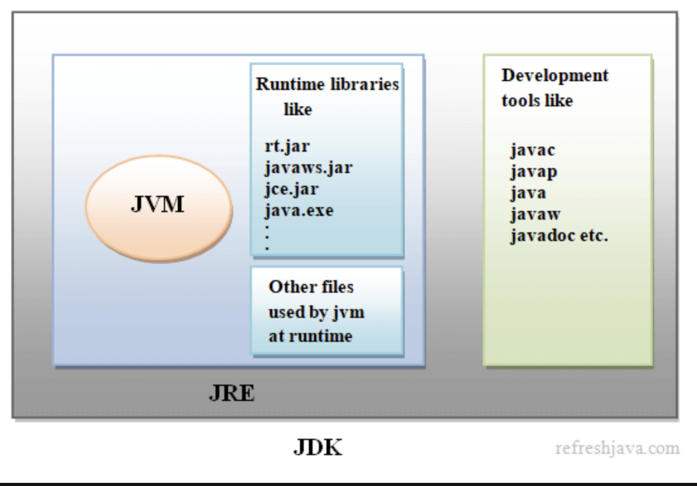
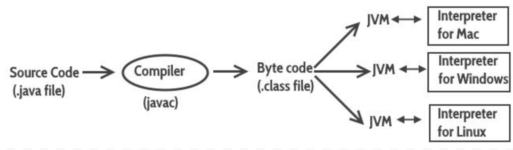

### 자바의 특징

- 객체 지향 프로그래밍 언어이다.
- 모든 운영체제에서 실행 가능하다.
- 메모리 자동 정리
  - JVM(Java Virtual Machine)에서 가비지 컬렉션을 수행한다.
- 라이브러리가 풍부하다.

### JDK (Java Development Kit)

- Java 프로그램을 개발하기 위해 필요한 도구 모음이다.
  - Java 컴파일러, 디버깅 도구, 자바 가상 머신 (JVM) 등을 포함하고있다.
    

### JVM (Java Virtual Machine)

우선, 자바 프로그램은 `javac` 명령어를 사용하여 컴파일이 완료되면 `.class` 확장자의 바이트 코드 파일이 생성된다.

- 인텔리제이에서는 `/out` 폴더에 컴파일된 `.class`이 생성된다.

바이트 코드 파일은 완전한 기계어가 아니므로, 바로 실행할 수 있는 파일이 아니다.

`java` 명령어를 통해 완전한 기계어로 번역해야 한다.

- 이때 사용되는 것이 JVM이다.
- JVM을 사용하면 다양한 운영체제에서 같은 파일에 대해, 수정하지 않고 사용할 수 있다.
  - `.class` 파일은 동일, 생성된 기계어 파일이 다름.



**[패키지란?]**

자바는 소스 파일 및 컴파일된 바이트 코드 파일들을 기능별로 쉽게 관리하기 위해 패키지를 사용한다.

파일 시스템의 폴더와 비슷하다고 생각하면 된다.

- 패키지를 생성하면, 패키지 안의 파일들을 해당 패키지를 명시해야 한다.
  ex) sec03.exam02 라는 패키지를 생성시

  ```java
  // sec03.exam02.RunStateExample 클래스 파일
  package sec03.exam02;

  public class RunStatementExample {
      public static void main(String[] args) {
          int x = 1;
          int y = 2;
          int result = x + y;
          System.out.println(result);
      }
  }
  ```

- 클래스 파일의 이름은 파일명과 동일해야 한다.

  ```java
  // sec03.exam02.RunStateExample 클래스 파일
  package sec03.exam02;

  // ❌ RunStateExample로 이름을 작명해야 한다.
  public class WrongExample {
      public static void main(String[] args) {
          int x = 1;
          int y = 2;
          int result = x + y;
          System.out.println(result);
      }
  }
  ```
