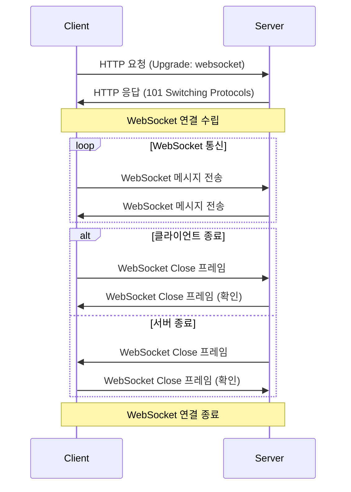

# 소켓

## 정의 및 특징(Socket)

실시간 양방향 통신을 위해 웹 애플리케이션과 서버 간의 지속적인 연결을 제공하는 프로토콜로 연결이 유지되는 동안 서버와 클라이언트가 수시로 데이터를 주고받을 수 있다는 특징이 있다.

- 실시간 데이터 전송
    
    언제든지 서버와 클라이언트가 데이터를 송수신할 수 있다.
    
- 연결 유지 비용 절감
    
    요청을 할때마다 서버와 새로운 연결을 해야하는 HTTP와 달리, 웹 소켓은 한 번의 연결 설정 후 지속적으로 데이터를 교환할 수 있어서 네트워크 부하와 지연 시간을 줄일 수 있다.
    
- 양방향 통신
    
    클라이언트와 서버가 동시에 데이터를 보낼 수 있다.
    
- 메세지 경계 존중
    
    메세지를 전송할 때 메세지 경계를 명확히 하여, 전송된 각 메세지가 독립적으로 구분될 수 있도록 보장한다.
    

## 사용 방법

시나리오



1. *(`if Protocal ==  wws`)서버와 클라이언트가 SSL/TLS 핸드세이크 (OSI Transport Layer)*
2. 서버와 클라이언트 간의 웹 소켓 연결 설정
3. 데이터의 송수신
4. 연결 종료

### 1. 서버와 클라이언트의 연결 및 수락


- 클라이언트는 WebSocket URL을 사용하여 서버에 요청
- WebSocket URL은 “ws”(비암호화) 또는 “wws” (암호화) 프로토콜을 HTTP/HTTPS 대신 사용한다.
    
    `ws://example.com:8000` , `wss://example.com:8000`
    
    <aside>
    💡 첫 연결이 `ws`가 아니라 `HTTP`를 이용해서 요청을 보낸다고 하는데, `ws` 프로토콜을 사용하는게 맞지 않나요?
    
    `WebSocket URL`을 적을 때 기존 `http://`를 보내는 곳에 `ws` 를 작성해서 마치 OSI 7계층의 HTTP 대신 별개의 프로토콜인 ws 프로토콜을 사용하는 것처럼 느껴진다.
    
    다만, 이는 틀렸다.
    
    `ws`는 HTTP 1.1을 확장한 방식이며, HTTP 1.1에서 몇가지 필드들을 추가해서 웹 소켓 방식을 구축하였다.
    
    따라서, 웹 소켓을 사용하는 요청임을 알리기 위한 방식이라고 생각하면 된다. 
    
    </aside>
    
    <aside>
    💡 `ws` 프로토콜의 핸드 세이크
    
    1. 클라이언트가 서버에게 Opening Handshake를 보낸다.
    
    ```
    GET /chat HTTP/1.1
    Host: localhost:8080
    Upgrade: websocket
    Connection: Upgrade
    Sec-WebSocket-Key: x3JJHMbDL1EzLkh9GBhXDw==
    Sec-WebSocket-Protocol: chat, superchat
    Sec-WebSocket-Version: 13
    Origin: http://localhost:9000
    ```
    
    1. HTTP 1.1로 요청이 사용되는 것을 확인할 수 있다.
    2. `Upgrade`: 프로토콜을 전환하기 위해 사용하는 헤더
        
        → 웹 소켓 요청 시에는 반드시 `websocket`이라는 값을 가지며, 이 값이 없거나 다른 값이면 웹소켓 접속을 중지
        
    3. `Connection`: 현재의 전송이 완료도니 후 네트워크 접속을 유지할 것인가에 대한 정보
        
        → 웹 소켓 요청 시에는 반드시 `Upgrade` 값을 가지며, 마찬가지로 값이 없거나 다른 값이면 웹소켓 접속을 중지
        
    4. `Sec-WebSocket-Key`: 유효한 요청인지 확인하기 위해 사용되는 임의(Random)로 생성된 1바이트 값을 Base64로 인코딩한 값
    
    1. 서버의 웹 소켓 업그레이드 응답
    
    ```
    HTTP/1.1 101 Switching Protocols
    Upgrade: websocket
    Connection: Upgrade
    Sec-WebSocket-Accept: s3pPLMBiTxaQ9kYGzzhZRbK+xOo=
    ```
    
    1. HTTP 1.1로 요청
    2. 101 Response: Switching Protocol 응답코드를 의미
    3. `Connection`: Upgrade 는 웹 소켓으로 업그레이드를 확인하였다는 뜻
    4. `Sec-WebSocket-Accept`: 클라이언트가 보낸 `Sec-WebSocket-Key` 를 유니크 ID를 더해서 SHA-1로 해싱한 후, Base64로 인코딩한 값
        
        → 연결이 개시되었음을 의미함.
        
    
    <aside>
    ❓ 1. 왜 ws 프로토콜을 따로 만들지 않고 HTTP 기반에서 사용했을까? (ChatGPT 대답)
        
        → 기존 웹 인프라와의 호환성 유지
        
    - 기존에 웹 브라우저와 웹 서버는 **HTTP 기반의 통신만 지원**했다.
    - 만약 웹 소켓을 완전히 독립적인 프로토콜로 만들었다면, 이를 지원하기 위해 **웹 서버, 방화벽, 프록시, 로드 밸런서 등의 인프라를 전부 수정해야 했을 것**이다.
    - 하지만 HTTP 기반에서 웹 소켓을 업그레이드하는 방식으로 만들면, 기존 인프라와의 **호환성이 유지**되며, 서버는 웹 소켓을 지원하지 않는 경우에도 HTTP 요청을 정상적으로 처리할 수 있다.
    </aside>
    
    <aside>
    ❓ 1. `Sec-WebSocket-Key`와 `Sec-WebSocket-Accept`는 무슨 용도로 사용되는가?
        [공식 문서](https://developer.mozilla.org/en-US/docs/Web/HTTP/Headers/Sec-WebSocket-Key)
    
    `Sec-WebSocket-Key`
    
    - HTTP 클라이언트를 WebSocket으로 업그레이드하도록 요청하기를 "정말로" 원한다는 것을 확인하기 위한 필드
    - 이때, 클라이언트가 보내는 Sec-WebSocket-Key 키의 값은 WebSocket 사양에 정의된 알고리즘을 사용하여 계산되므로 *보안을 제공하지 않습니다*.
    
    `Sec-WebSocket-Accept`
    
    - 서버가 웹소켓 연결을 시작할 의향을 알리기 위해 서버에서 클라이언트로 전송하는 헤더
    - 그저 `258EAFA5-E914-47DA-95CA-C5AB0DC85B11`을 덧붙이고, 새 값의 SHA-1 값을 가져온 다음, [base64](https://developer.mozilla.org/ko/docs/Glossary/Base64)로 인코딩
        - 기능이 구현되어 있다면 누구나 만들수 있는 값
    
    ✅ 개인적으로는 소켓이 네트워크 사용량이 많고 컴퓨터에 부하가 많이가서, 다시한번 확인하는게 아닐까 싶습니다.
    
    </aside>
    
    <aside>
    ❓ 1. `Sec-WebSocket-Key`와 `Sec-WebSocket-Accept`는 개발자가 설정해야 하는 값인가?? 설정하는 것을 본적이 없는데..?
    
    [웹소켓 API](https://developer.mozilla.org/ko/docs/Web/API/WebSocket) 또는 웹소켓을 사용하는 다른 라이브러리를 사용해서 새로운 연결을 열게 된다면 이러한 과정 대부분 또는 전부가 처리된다
    
    ```jsx
    const webSocket = new WebSocket("ws://destination.server.ext", "optionalProtocol");
    ```
    
    </aside>
    
    <aside>
    ❓ 1. 100번대 응답코드
    
    1번대 응답코드는 정보(Information)를 나타내는 응답 코드로, 클라잉너트가 보낸 요청을 서버가 처리하고 있음을 의미함. (❌ 처리함)
    
    </aside>
    
    <aside>
    ❓ HTTP 3까지 나왔는데 HTTP 1.1을 사용하는 이유?
    
    1. HTTP/2는 이 메커니즘의 사용을 명시적으로 허용하지 않고, HTTP/1.1에서만 명시적으로 허용
    2. 여전히 많은 웹 애플리케이션이 HTTP 1.1을 사용한다.
        
        HTTP 3 부터는 UDP 기반이어서 아직 완전히 표준으로 자리잡지 못했다.
        
    </aside>
    
    </aside>
    
    <aside>
    💡 `ws` 와 `wss`의 차이
    
    `wss`의 마지막 s는 secure의 약자로, TLS/SSL을 적용한다는 것을 의미한다.
    
    ✅ TLS와 TCP는 다른 계층의 다른 역할을 수행합니다. (헷갈리지 말것)
    
    
    
    </aside>
    

### 2. 데이터의 송수신


- 연결이 설정되면 서버와 클라이언트는 양방향으로 메시지를 자유롭게 주고받을 수 있습니다.
- 이 때 메시지는 프레임 형태로 전송되며, 이를 통해 큰 데이터도 분할하여 전송할 수 있습니다.

<aside>
💡 소켓은 Full-Duplex(전이중) 방식으로 클라이언트 → 서버 뿐만 아니라, 서버 → 클라이언트로의 패킷 전송도 가능하다.

- HTTP는 Half-Duplex(반이중) 방식이다.
</aside>

### 3. 연결 종료 (커넥션 닫기)


A와 B가 소켓 연결되어 있다고 가정하겠습니다.

1. 연결 주체 (브라우저나 서버) 중 한쪽(A)에서 커넷션 닫기(close)를 원하는 경우엔 보통 숫자로 된 코드와 문자로 된 사유가 담긴 '커넥션 종료 프레임’을 전송하게 됩니다.
2. 다른 한쪽(B)에서 요청 받은 Close 프레임에 대한 확인 응답을 보냅니다.
3. 이후, 다른 한쪽 (B)에서도 소켓을 닫기 위한 Close 프레임을 A에게 전달합니다.
4. A는 이를 받아, 응답을 보냅니다


1. 클라이언트가 서버에게 `FIN` 세그먼트를 전송한다.
    - 클라이언트는 종료 응답을 기다린다는 의미로 `FIN-WAIT1` 상태로 접어들게 된다.
        - `FIN-WAIT1` : 소켓이 프로세스로부터 회수되어 커널이 처리하는 단계에 진입한 상태 `(ophan socket)`
2. 서버는 응답을 받은 후, 클라이언트에게 자신의 소켓 프로세스 종료를 요청하며 기다리는 `CLOSE-WAIT` 상태에 접어든다.
    - `CLOSE-WAIT` 상태는 내부 소켓 종료시까지 잠깐 유지된다. (프로세스 회수)
        - `FIN` 을 받았더라도, 아직 보내야할 데이터가 있다면 이를 보내고 소켓을 종료해야 하기 때문에 텀이 존재한다.
    
    또한, 서버는 종료 신호를 받아 내부적으로 소켓을 종료하겠다는 의미로 `FIN`에 대한 `ACK`을 보낸다.
    
    <aside>
    ❔ 서버가 전송한 ACK가 모종의 이유로 계속 클라이언트에 안오면 `orphan socket`이 계속 쌓이나요?
    
    - `net.ipv.tcp_orphan_retires` 라는 커널 파라미터가 존재한다. 이는, FIN을 재전송할 횟수를 지정하게 된다.
    → 87로 설정하면 기본 전송 1회 + 재전송 7회를 시도한다.
    </aside>
    
3. ACK를 받은 클라이언트는 종료 신호를 수신했다는 세그먼트를 전달받았으므로, 서버의 소켓 종료신호를 기다리는 `FIN-WAIT2` 상태로 접어들게 된다.

---

1. 서버가 소켓이 정상적으로 종료되면 이를 클라이언트에게 알려주고자 `FIN` 신호를 보내게 된다.
    - 서버는 정상적으로 종료했음을 나타내는 `LAST-ACK`  상태가 된다.
    
    <aside>
    ❔ 서버의 마지막 FIN에 대한 ACK를 모종의 이유로 전달받지 못하면 어떡하나요?
    
    서버는 일정 시간 동안 FIN에 대한 ACK를 받지 못하는 경우, 본인의 FIN 패킷을 재전송합니다.
    
    </aside>
    
2. 클라이언트는 소켓을 완전히 종료한다는 ACK를 서버에 보냅니다.
    - 클라이언트는 TIME-WAIT 상태가 된다.
    
    <aside>
    ❔ 서버가 마지막 ACK를 모종의 이유로 못받으면 어떻게 하나요?
    
    클라이언트는 마지막 ACK를 보내고 TIME-WAIT 상태가 됩니다.
    
    해당 상태는 2 * MSL (Maximum Segment Lifetime) 만큼 유지되며, 서버가 FIN 패킷을 재전송했을 때는 대비하는 상태라고 생각하시면 됩니다.
    
    </aside>
    

<aside>
💡 먼저 연결 해제를 시도하는 쪽에서는 TIME_WAIT 상태에 돌입합니다. 이러한 소켓이 계속 생겨나면 문제가 발생하지 않나요?

네

먼저, 소켓은 클라이언트 IP + 포트 + 서버 IP + 포트 하나를 점유하고 사용하게 됩니다.

→ 로컬 포트가 고갈되게 되는 경우가 발생할 수 있다.

해결 방법

- 커널의  `net.ipv4.tcp_tw_resuse` 파라미터로 TIME_WAIT 상태의 소켓 중 프로토콜상 사용해도 무방해 보이는 소켓을 재사용한다.
- Connection Pool 을 통해 연결을 지속적으로 유지 및 관리한다.
- 커넥션 `Keep-Alive` 설정
    - 좀비 소켓이 되지 않도록 주의해야 한다.
</aside>

### 프레임간 경계를 의미하는 FIN과 소켓 커넥션 종료에 사용되는 FIN은 같은 FIN인가??

아니다.

1. 프레임간 경계를 의미하는 FIN 비트는 “이 프레임이 메세지의 마지막 프레임인지 여부”를 의미합니다.
- FIN = 1 : 해당 프레임이 메세지의 마지막 프레임임을 의미
- FIN = 0 : 메세지가 아직 끝나지 않았으며, 추가 프레임이 이어짐을 의미

1. TCP에서의 FIN 플래그는 “이제 더 이상 데이터를 보내지 않겠다. TCP 연결을 해제하자”는 뜻이다.
- 4-Way Handshake 과정을 통해 수행된다.

OSI 계층의 관점에서 살펴보면 더 명확하다.

WebSocket 프로토콜은 7계층 Application Layer에 해당하고, TCP는 4계층 Transport Layer에 해당하므로, 완전히 다른 FIN값이다.
